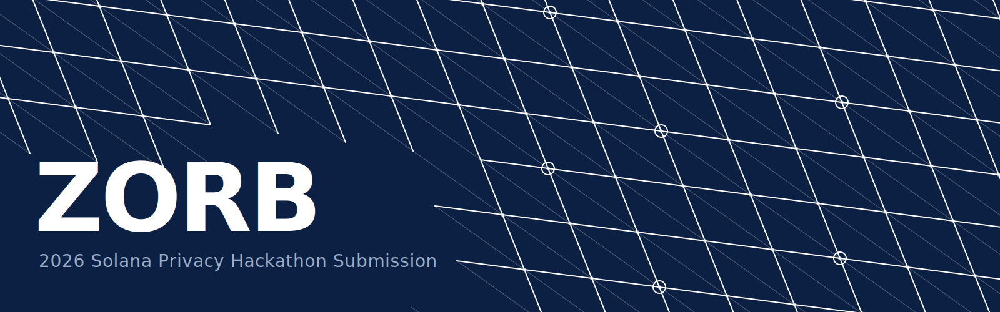
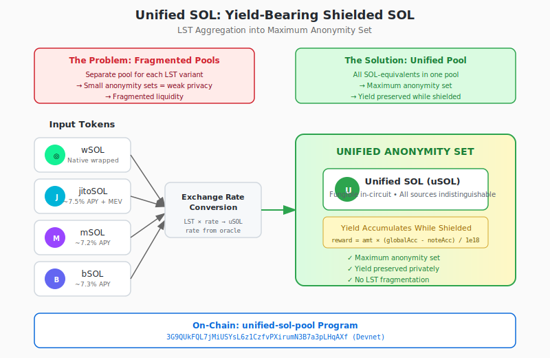

<div align="center">



</div>

ZORB is a privacy protocol on Solana that enables private transfers on Solana similar to Zcash. Native to Solana, it offers **Unified SOL** – a yield-bearing shielded SOL asset aggregating multiple LSTs into a unified anonymity set with private staking, allowing users to realize private yield without revealing balances, assets or transaction history.

**ZORB offers private transactions at the same cost of Solana transactions.**

> **Warning**: This software is unaudited and experimental. Use at your own risk. Do not use with funds you cannot afford to lose.

## Our Contributions

### 1. Unified SOL: Yield-Bearing Shielded SOL

SOL equivalents (wSOL, jitoSOL, mSOL, bSOL) aggregate into unified anonymity set for fungibility in-circuit, receive yield-bearing shielded SOL that earns staking yield in-circuit.

<!-- <p align="center">
  
</p> -->

See [Yield Mechanism](docs/YIELD_MECHANISM.md) for details.

**Epoch duration**: `UPDATE_SLOT_INTERVAL = 2700 slots × 400ms/slot = 1080s = 18 min`

```
        ◄──────────── Epoch N (≥ 2700 slots, ~18 min) ─────────────►

wSOL     ────●──────────────────────────────────────────────────────┐
          harvest                                                    │
jitoSOL  ──────●────────────────────────────────────────────────────┤
            harvest                                                  │
mSOL     ────────●──────────────────────────────────────────────────┤
              harvest                                                │
bSOL     ──────────●────────────────────────────────────────────────┤
                harvest    ↑ proofs generated against frozen         │
                           ↑ globalAcc + harvested_exchange_rate     │
                                               all LSTs harvested ──┤
                                                                     ▼
globalAcc ═══════════════════════════════════════════════════ finalize ═══
          (frozen from prev epoch — proofs target this)   accumulator += Δ
                                                          freeze new rates
                                                          epoch N → N+1
```

> **State Contention Prevention**: Proving is against the frozen `globalAcc` value, which remains stable for a minimum of 2700 slots (~18 min) between `finalize_unified_rewards` calls. This epoch duration accommodates proof generation (10-60s), transaction submission (5-30s), and a safety buffer for retries—ensuring proofs remain valid without risking invalidation from accumulator updates.

### 2. Rent-Free Nullifier Scheme

Private state requires commitments and nullifiers ([Hopwood et al.](https://eprint.iacr.org/2018/962.pdf)). On Solana, nullifiers are typically represented as PDAs — each costing a rent-exempt minimum in permanently locked SOL.

**Permanent nullifier rent at scale** (~0.000954 SOL per PDA, per [Privacy Cash](#why-this-matters-privacy-cash-protocol-analysis) on-chain data):

| Nullifiers | Txs @ 2 nullifiers per | Txs @ 4 nullifiers per | SOL locked | @ $200/SOL | @ $90/SOL |
|--:|--:|--:|--:|--:|--:|
| 1 | 1 | 1 | 0.000954000 | $0.19 | $0.09 |
| 1,000 | 500 | 250 | 0.954000000 | $191 | $86 |
| 10,000 | 5,000 | 2,500 | 9.540000000 | $1,908 | $859 |
| 100,000 | 50,000 | 25,000 | 95.400000000 | $19,080 | $8,586 |
| 1,000,000 | 500,000 | 250,000 | 954.000000000 | **$190,800** | **$85,860** |

We eliminate this cost by pushing nullifiers into an indexed merkle tree, allowing PDA closure once the nullifier is frozen in all provable epoch roots.

Similar prior work includes Light Protocol's concurrent merkle tree; we use an [indexed merkle tree described by Aztec](https://docs.aztec.network/developers/docs/foundational-topics/advanced/storage/indexed_merkle_tree) for lower constraints (8-16x) due to reduced height.

All transactions present a non-membership proof against a provable nullifier epoch root. This is delegatable to a proof server (and with GPUs, extremely fast) as only nullifiers are exposed.

Batch insertion and PDA closure amortize the cost of maintaining the nullifier set to **transaction fees only** — no permanent rent.

<!-- <p align="center">
  
</p> -->

#### Why This Matters: Privacy Cash Protocol Analysis

We analyzed [Privacy Cash](https://privacy.cash) (`9fhQBbumKEFuXtMBDw8AaQyAjCorLGJQiS3skWZdQyQD`), a live Solana privacy protocol, to quantify nullifier PDA costs. The protocol has **&#126;267 SOL (&#126;$53K at $200/SOL) in nullifier PDA rent** permanently locked:

| Metric | Value |
|--------|-------|
| **Nullifier PDAs on-chain** | 279,836 |
| **Rent per nullifier PDA** | &#126;0.000954 SOL (9 bytes) |
| **Total nullifier rent locked** | **&#126;267 SOL** |

*Counted via `getProgramAccounts` filtered by nullifier discriminator (`fa1feeb1d56230ac`) on Feb 5, 2026. Program has 362,264 total accounts; 279,836 are 9-byte nullifier PDAs, the rest are UTXO notes, merkle trees, and config.*

View protocol analytics: [Privacy Cash on OrbMarkets](https://orbmarkets.io/protocol/9fhQBbumKEFuXtMBDw8AaQyAjCorLGJQiS3skWZdQyQD)

### 3. Multi-Asset Transact with Public-Slot Routing

Multi-asset split-join circuit handles value conservation of transacting with optional *yield accumulation*.

**`nRewardLines`** public yield accumulators, **`nRosterSlots`** private routing slots, and **`nPublicLines`** deposit/withdrawal lines interconnect via one-hot selectors—notes and public lines select into roster slots, which fetch accumulators from reward lines. Per-slot value conservation is enforced while the mapping remains hidden, creating plausible deniability.

<!-- <p align="center">
  
</p> -->

See [Circuit Routing Architecture](docs/CIRCUIT_ROUTING.md) and [Yield Mechanism](docs/YIELD_MECHANISM.md) for details.

> **State Contention Prevention**: All 8 reward accumulators used as public inputs are frozen values from the previous epoch finalization (~18 min stale). This eliminates state contention for multi-asset proofs—the circuit proves against stable accumulator snapshots rather than live on-chain values that could change during proof generation.

---

## Live Demo

**Devnet Application**: [https://devnet.zorb.cash/](https://devnet.zorb.cash/)

### Pinocchio/Panchor Solana Programs

Three Rust programs built with [Pinocchio](https://github.com/febo/pinocchio) (low-CU runtime) and [Panchor](vendor/panchor/) (lightweight `no_std` framework):

| Program | Location | Description |
|---------|----------|-------------|
| **Shielded Pool** | `programs/shielded-pool/` | Hub/router that verifies Groth16 proofs, manages commitment Merkle tree, tracks nullifiers, and dispatches to pool programs via CPI |
| **Token Pool** | `programs/token-pool/` | Handles SPL token deposits/withdrawals with epoch-based yield distribution |
| **Unified SOL Pool** | `programs/unified-sol-pool/` | Manages LST (jitoSOL, mSOL, etc.) with exchange rate conversion and staking yield capture |

## Devnet Deployment

These may be changed without notice.

| Network | Program | Address |
|---------|---------|---------|
| Devnet | Shielded Pool | `GkMmgCdkA5YRXi3BEUSgtGLC3m4iiT926GUVkfqauMU6` |
| Devnet | Token Pool | `7py6sKLtEk7TcHvpBeD16ccfF4ypRsY6HkpJqN9oSC3S` |
| Devnet | Unified SOL | `3G9QUkFQL7jMiUSYsL6z1CzfvPXirumN3B7a3pLHqAXf` |

---

## Security Properties

| Property | Mechanism |
|----------|-----------|
| **Value Conservation** | Per-slot equation: `sumIn + publicDelta = sumOut` |
| **Asset Isolation** | Roster uniqueness prevents cross-asset routing |
| **Yield Realization** | `reward = amount × (globalAcc - noteAcc) / 1e18` |
| **Plausible Deniability** | 8 reward lines hide which 1-2 assets are used |
| **No State Contention** | Frozen accumulator for &#126;18 min proof validity |
| **Double-Spend Prevention** | Indexed Merkle Tree with non-membership proofs |
| **Nullifier Atomicity** | Batch insertion chains N updates atomically |

---

## Project Structure

```
.
├── programs/
│   ├── shielded-pool/     # Hub program with ZK verification
│   ├── token-pool/        # SPL token deposit/withdraw
│   └── unified-sol-pool/  # LST with exchange rates
├── circuits/
│   ├── circom/            # Circom ZK circuits
│   └── src/               # TypeScript circuit utilities
├── crates/
│   ├── zorb-program-ids/  # Centralized program IDs
│   └── zorb-pool-interface/ # Shared pool interface
└── vendor/
    └── panchor/           # Lightweight Solana framework
```

## Building

```bash
# Build all programs
cargo build-sbf

# Build with devnet program IDs
cargo build-sbf --features devnet

# Run tests
cargo test
```

## Technology

- **Zero-Knowledge Proofs**: Groth16 with BN254 curve
- **Framework**: [Panchor](vendor/panchor/) - lightweight no_std Solana framework
- **Runtime**: Pinocchio for low-CU operations